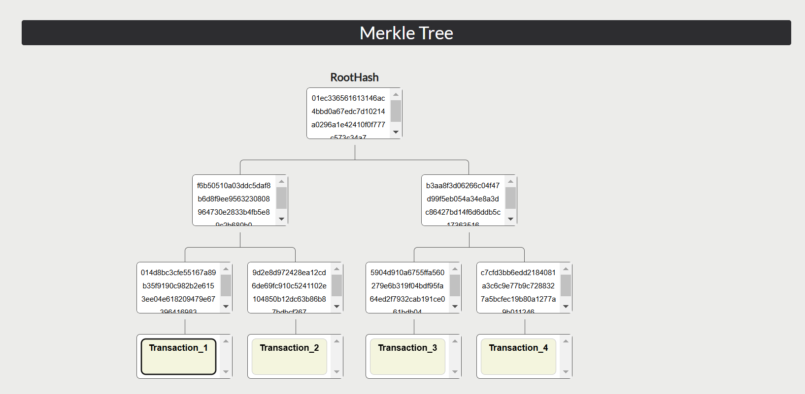
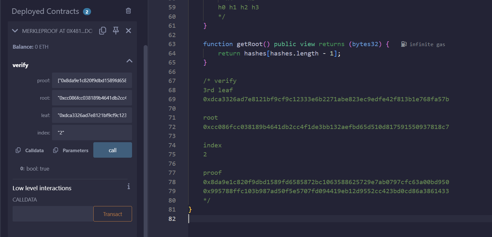
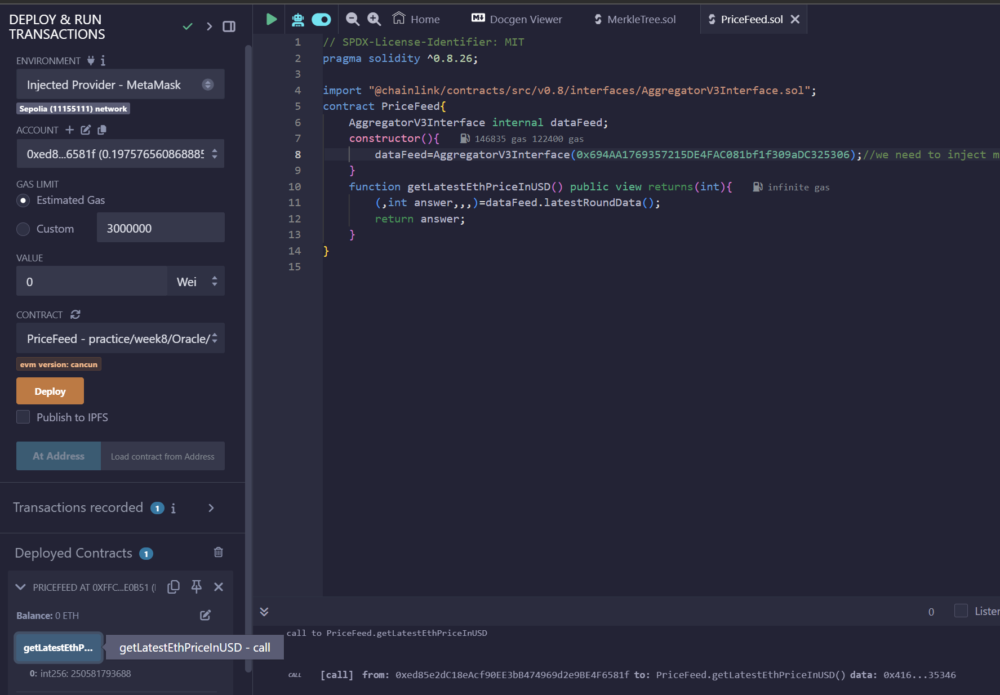

# smart_contract

## todo

## bookmark

- main 
- lec 1012
  - Import
- lec1019
  - erc20

## setup remix

```bash
npm install -g @remix-project/remixd
```

### using the local file system for remix

```bash
remixd
#Select connect to local host on the remix web editor
```

## project

- go on etherscan to find examples for smart contracts

## solidity notes

### gas

- every operation costs gas
  - gas estimates the cost of transaction, which can be evaluated in eth
- the gas limit should be reasonable so that transactions have enough gas to operate
- if gas limit is reached, transactions will roll back
- transaction cost- execution cost is the reward given to the validator
- 1 ether = 10^18 wei

### state variables

- interacting with state variables is expensive in terms of gas, try to minimize this by using local caches.

### keywords

- the **view** keyword is used when a function does not modify the state variables
- a function that doesn't read or modify the variables of the state is called a **pure** function.
- storage, memory and calldata 
  - **Memory** is used to store temporary data that is needed during the execution of a function. 
  - **Calldata** is used to store function arguments that are passed in from an external caller. 
    - calldata is readonly
  - **Storage** 用來指到state var
    - 如果你把變數宣告成storage，當你用這個變數去指到state variable，你就會改到state variable
    - 但用memory就改不到
- **REVERT** will still undo all state changes, but it will be handled differently than an “invalid opcode” in two ways:
  - It will allow you to return a value.
  - It will refund any remaining gas to the caller.
- assert will not refund on failure
- **interface**就是拿來繼承用的
- A **modifier** is a special type of function that you use to modify the behavior of other functions. Modifiers allow you to add extra conditions or functionality to a function without having to rewrite the entire function.
  - the _ symbol
    - Before Function Execution:
      require(!locked, "No reentrancy"); checks if the locked variable is false. If locked is true, the function call is rejected with the message “No reentrancy”.
      locked = true; sets the locked variable to true, indicating that the function is now executing.
    - Function Body Execution:
      The _ symbol is where the actual function body is executed. When the function is called, the code inside the function replaces the _ symbol.
    - After Function Execution:
      locked = false; sets the locked variable back to false, allowing future calls to the function.
  - 有點像是幫function打補釘
- **internal** function就像private method
- **external** function只能給別人用
- **fallback** function
  - In Solidity, a fallback function is a special function that is executed under specific conditions:
    - When a function that does not exist is called.
    - When Ether is sent directly to a contract but the receive() function does not exist or msg.data is not empty
    - The fallback function is defined without a name, parameters, or return values. It is typically used to handle unexpected messages and ensure the contract remains in a valid state3. Here’s a simple example:
      ```solidity
            // SPDX-License-Identifier: MIT
      pragma solidity ^0.8.0;

      contract FallbackExample {
          event Log(string func, uint256 gas);

          // Fallback function must be declared as external.
          fallback() external payable {
              emit Log("fallback", gasleft());
          }

          // Receive function is a variant of fallback that is triggered when msg.data is empty
          receive() external payable {
              emit Log("receive", gasleft());
          }

          // Helper function to check the balance of this contract
          function getBalance() public view returns (uint256) {
              return address(this).balance;
          }
      }
      ```
      - if there is no fallback function, the transaction will not go through
- msg.value, msg.sender
  - msg.value is the amount to send, it is in visible in the LHS of the remix ide
  - msg.sender is just the address of the sender
  - msg.data is the data sent
  - this.balance is the amount of ether a contract has
- **delegate call**
  - to use another functions method to update my own data
    - I (who is using the delegate function) must have exactly the same state variable layout
  - 用callee反查就好，比較安全
- payable
  - anything that receives ether must be payable
  - if a constructor is not payable, you cannot send ether to balance on creation
- **new**可以建立別的contract
- 動態生成其他contract
  -  之後可以用script deploy
- **indexed**
  - 參數帶indexed表示他會出現在log裡面
- **emit**
  - emit用來發事件，可以讓外部收到emit
- **immutabel**
  - State variables can be marked immutable which causes them to be read-only, but assignable in the constructor. 

### sending and receiving

- the sender must have a payable method
  - input the value in the LHS panel 
- the receiver must have the receive method

### ABI and bytecode

The byte code is the binary representation of the contract.
THe ABI is human readable text that represents the contract.

For example:

This contract results in this ABI.

```solidity
pragma solidity ^0.8.0;

contract SimpleStorage {
    uint256 storedData;

    function set(uint256 x) public {
        storedData = x;
    }

    function get() public view returns (uint256) {
        return storedData;
    }
}
```

```json
[
    {
        "constant": false,
        "inputs": [
            {
                "name": "x",
                "type": "uint256"
            }
        ],
        "name": "set",
        "outputs": [],
        "payable": false,
        "stateMutability": "nonpayable",
        "type": "function"
    },
    {
        "constant": true,
        "inputs": [],
        "name": "get",
        "outputs": [
            {
                "name": "",
                "type": "uint256"
            }
        ],
        "payable": false,
        "stateMutability": "view",
        "type": "function"
    }
]
```


### ERC20 tokens
  
- IERC20
  - IERC20 is an interface that defines the standard functions and events that any ERC20 token contract must implement. 
- ERC20
  - ERC20 is a contract that implements the IERC20 interface.  
  - 規範token的interface
  - mint是無中生有
  - burn是把token燒掉
  - if a token has **decimals** set to 18, it means that the token can be divided into (10^{18}) smaller units
  - approve
    - 授權別人花自己的token
    - allowance是一個state variable，紀錄誰授權了誰可以花多少token
    - 授權給別人的token可以burn掉
    - 不夠還可以無中生有mint
- deploying mytoken.sol will generate 100 tokens in total supply
- To verify a single file for deployment on the test net, we can use the flatten option to add all dependencies to a single file.
  - in remixIDE, right click then click flatten

### shared wallet

- only the owner can add or remove owners

### addressbook

- alias一樣也是state var,紀錄誰對誰的alias

### IERC721 NFTs

- NFT
  - An NFT, or non-fungible token, is a unique digital asset that represents ownership or proof of authenticity of a specific item or piece of content, typically stored on a blockchain. Unlike cryptocurrencies such as Bitcoin or Ethereum, which are fungible and can be exchanged on a one-to-one basis, NFTs are unique and cannot be exchanged on a like-for-like basis.
- 製作照片的NFT
  - 寫一個繼承erc721的contract
  - 上傳照片到IPFS platform, e.g. pinata
  - publish and verify contract
  - set the uri to in etherscan when minting
    - will _setTokenURI(tokenId, uri);

#### Engllish Auction

- bid on NFTs
- we need to deploy a NFT beforehand
  - and approve the bidder to sell the nft
- 我們可以用block.timestamp+2 days設定結束時間
- bid結束之後，NFT owner 會換人，剩下沒買到的買家需要withdraw

### openzeppelin

- pausable
  - the owner can pause a contract in case of vulnerability

#### dutch auction

- self destruct will delete an adress

### smart contract oracle

- read data from outside world

### Merkle Tree

week8

- example: 
- the height of the merkle tree does not change 
- A complete binary tree is another name for the strict binary tree. Only if each node has either 0 or 2 offspring can the tree be regarded as strict binary tree.
- a path in the merkle tree is addtional info needed to compute the root hash for a particular leaf.
  - 
- usally the merkle tree is complete, but nodes appended on the right can be the only child
- merkle.sol
  - 
  - 期末會考

## DeFi

- stable coin
  - 用美金買，買的時候mint。贖回的時候burn
- anonymity is key
- lending in Defi
  - give out tokens to burrowers
- low exchange rate
- insurance
  - get external information from outside, then deploy smart contract
    - the acquiring of external information relies on crowd to provide information, the crowd is rewarded a small amount of ether
- oracles
  - get external info
    - e.g. usd exchange rate <https://docs.chain.link/data-feeds/price-feeds/addresses?network=ethereum&page=1>
  - pricefeed.sol   

## Dune SQL queries

- first step is to find the table name, e.g. **ethereum.transactions**

  ```txt
  select block_time from  ethereum.transactions LIMIT 3
  ```

- when you encounter errors during the query, you can look at the suggestions for position i.
- dashboard
  ```sql
  select  DATE_TRUNC('day', time ) as dt, count(*)as num_blocks
  from ethereum .blocks
  where time>=(DATE_TRUNC('day',CURRENT_TIMESTAMP)-INTERVAL '90' day )
  and time <=DATE_TRUNC('day',CURRENT_TIMESTAMP)
  group by 1 
  order by 1;
  ```
  - The COUNT() function returns the number of rows that matches a specified criterion.
  - the where clause limits the result to the most recent 90 days, and no later than today
  - grooup by 1 is to group by the first element of num_blocks, which is DATE_TRUNC('day', time )